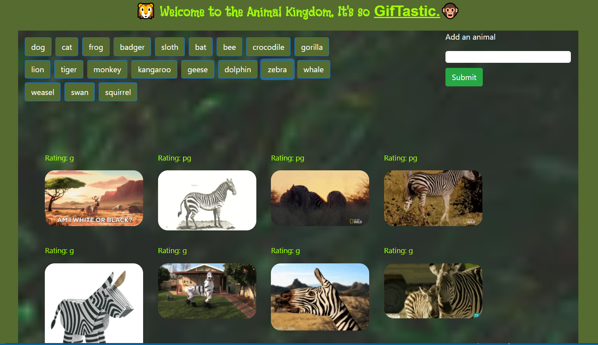

# GifTastic

Giphy API and javaScript / jQuery

## Technologies 

- Giphy API

- AJAX

- JavaScript

- jQuery for DOM manipulation

- HTML5

- CSS3

- Bootstrap4

- Google Fonts

## More Info

- Application layout and styling was programed with HTML5, CSS3, Bootstrap4 and Google Fonts

- jQuery was used to program:

    * the buttons of animals array and of the user text input
    * the gif image still and animation display when clicked

- The gif image display and its ratings were generated with AJAX call using a queryURL, along with a Giphy API key. The right perameters were used to GET the appropriate response when clicked

## Note

- Gif images (Spin/Rotate) animation and mobile application responsiveness was intiated with CSS3

- Alert pop up response when user click Submit button on a blank text input was initiated with javaScript

## App View

